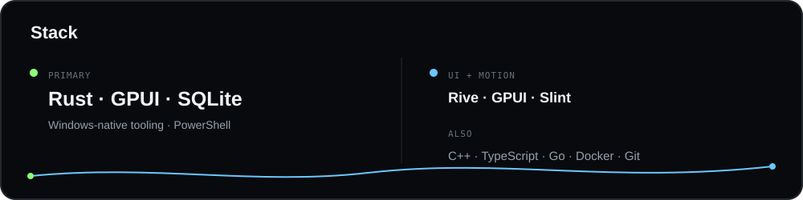

<!-- Ali Sh / Mr-CyReX. Visual system: DESIGN.md. -->

<picture>
  <source media="(max-width: 600px) and (prefers-reduced-motion: reduce)" srcset="./assets/hero-mobile-still.svg">
  <source media="(prefers-reduced-motion: reduce)" srcset="./assets/hero-still.svg">
  <source media="(max-width: 600px)" srcset="./assets/hero-mobile.svg">
  
</picture>

<picture>
  <source media="(max-width: 600px)" srcset="./assets/stack-mobile.svg">
  
</picture>

  
  
  
  
  
  

  
  
  
  
  
  
  

 

<picture>
  <source media="(max-width: 600px) and (prefers-reduced-motion: reduce)" srcset="./assets/projects-mobile-still.svg">
  <source media="(prefers-reduced-motion: reduce)" srcset="./assets/projects-still.svg">
  <source media="(max-width: 600px)" srcset="./assets/projects-mobile.svg">
  
</picture>

 

<picture>
  <source media="(max-width: 600px) and (prefers-reduced-motion: reduce)" srcset="./assets/motion-mobile-still.svg">
  <source media="(prefers-reduced-motion: reduce)" srcset="./assets/motion-still.svg">
  <source media="(max-width: 600px)" srcset="./assets/motion-mobile.svg">
  
</picture>

<picture>
  <source media="(max-width: 600px)" srcset="./assets/activity-mobile.svg">
  
</picture>

  
  

  
  

Profile in plain text

<strong>Ali Sh · Mr-CyReX · &lt;/Cy&gt;</strong> 
Software developer &amp; motion graphics designer

Mostly Rust. I build tools I wish existed, then obsess over how they feel.

<strong>Stack:</strong> Rust · GPUI · SQLite · Rive · Windows-native tooling · PowerShell. 
C++ · TypeScript · Go · Docker · Git · GitHub · Slint.

Most of my current work is private. These are the pieces I can actually show.

<ul>
<li><strong>Hexus.</strong> The thing I spend most of my time on: my own work harness for projects, agents, tools, and the machine. Rust · GPUI · SQLite.</li>
<li><strong>Computer Control MCP.</strong> Built because screenshot-click guessing got old. Agents get real Windows controls instead. Rust · Windows · IPC · MCP.</li>
<li><strong>Rill.</strong> My excuse to keep pushing GPUI, Rive, window motion, and native desktop UX a little harder.</li>
<li><strong>OpsDesk.</strong> A proper internal-tool demo for work that still lives in spreadsheets. Roles, approvals, imports, audit trails, local data.</li>
</ul>

Motion still shapes how I build. Hierarchy, timing, transitions, responsiveness, and visual polish are engineering concerns to me — not decoration added at the end.

Most of this work is private, so GitHub only gets to count part of it.

