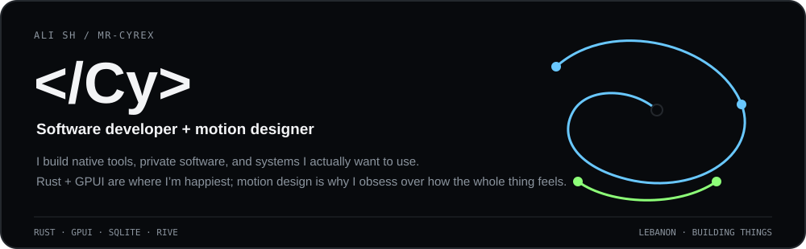
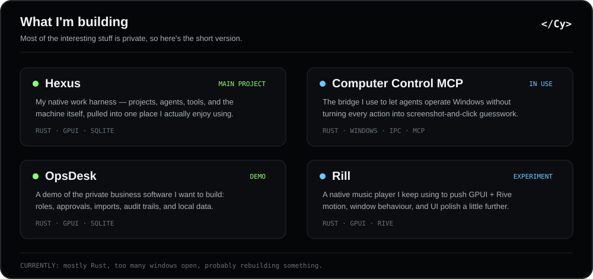
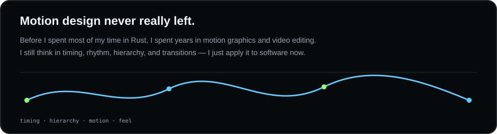

<!--
  Cy / Mr-CyReX — profile README
  The final transparent WebP identity/avatar can replace or sit above hero.svg later.
-->

  

  
  

 

<h2 align="center">Stack</h2>

  

 

<table align="center">
<tr>
<td width="50%" valign="top">

**Primary** 
Rust · GPUI · SQLite · Windows-native tooling · PowerShell

**UI / motion** 
Rive · GPUI · native animation systems · motion design

</td>
<td width="50%" valign="top">

**Working stack** 
C++ · TypeScript · Go · Docker · Git · GitHub · Slint

**Systems** 
MCP · IPC · local-first architecture · process control · SQLite-backed state

</td>
</tr>
</table>

 

  

 

  

 

---

## GitHub activity

  

 

Most of what I'm building right now is private, so the public-repo counters only tell part of the story.

